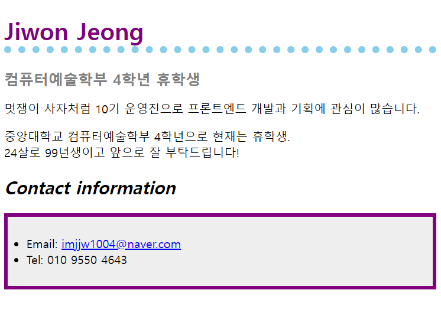

##  HTML/CSS - Q1

#### &nbsp;&nbsp; 출제자 : 정지원 

---
### 1. 개념잡기

> HTML  구조에 대한 문제입니다. 
각 번호에 해당하는 값을 적어주세요!
> 

### 2. 실습 - 구글링 가능

> 아래와 같은 형식으로 자신을 소개해보세요!
주어진 형식은 유지하되 색깔은 변경할 수 있습니다.
> 

- 조건 1 ) Email 주소는 mailto로 자신의 이메일로 메일을 전송할 수 있도록 하이퍼링크를 겁니다.
- 조건 2 ) Email 주소를 hover 했을 때, 색깔이 바뀌어야 합니다.

