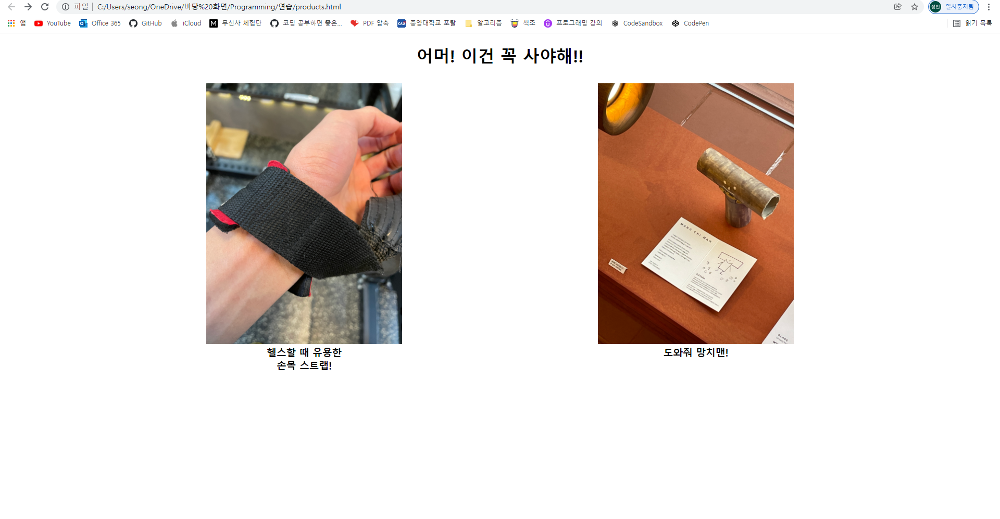
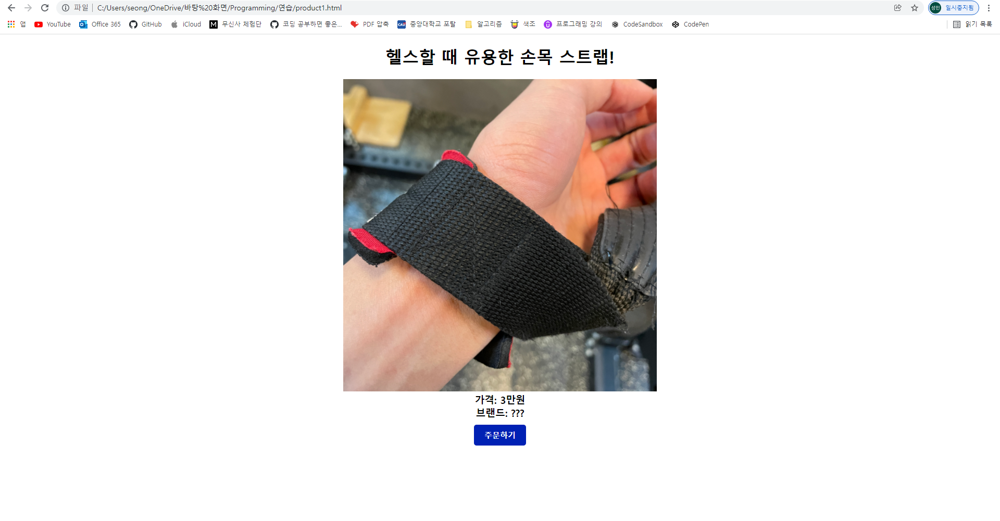

## 상품 페이지를 만들어 보세요!

---

1. 판매 또는 구매하고 싶은 2가지의 상품을 정하세요!
2. 하나의 페이지에 2가지 상품의 사진을 버튼으로 삼아 상품의 상세 페이지로 넘어가도록 하세요!
3. 2가지 상품 중 한가지만 실제 쇼핑몰처럼 상세설명 하듯 꾸며봐요!

완성하면 아래와 같은 결과물이 나옵니다!

---

**상품 페이지**

**상세 페이지**

