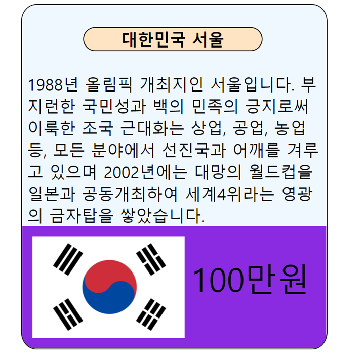

##  HTML/CSS - Q4

#### &nbsp;&nbsp; 출제자 : 서지수

### 카드만들기

> 친구들과 부루마블 게임을 하던 멋쟁이사자는 문득 부루마블의 카드를 소개하는 웹사이트를 만들기로 결심합니다.
다음과 같이 부루마블 씨앗증서를 만들어보며 카드모양 만들기에 익숙해져 봅시다.  
> 다음과 같은 형식은 유지하되, 내용(이미지, 텍스트)은 변경해도 무방합니다. 

- 조건 1 ) 카드의 영역을 반으로 나누어, 위와 아래의 색을 다르게 해야합니다.
- 조건 2 ) 카드의 모서리는 둥근 모양으로 만듭니다.
- 조건 3 ) 국기와 가격이 나란히 있도록 만듭니다.

