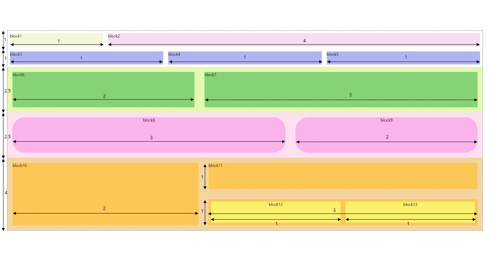

##  HTML/CSS - Q2

#### &nbsp;&nbsp; 출제자 : 윤선영

---

### 조건
1. 그림의 block들간의 길이 비를 지켜서 만들어보기
2. 비를 제외한 margin, padding, border, text-align, background-color는 자유롭게 설정 가능
3. flex를 이용해봅시다.
4. flex에 대한 개념 => https://studiomeal.com/archives/197 에 정리가 잘 되어 있네용

